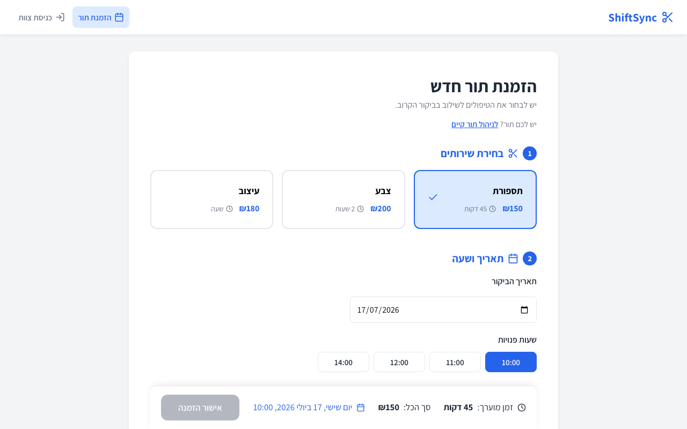
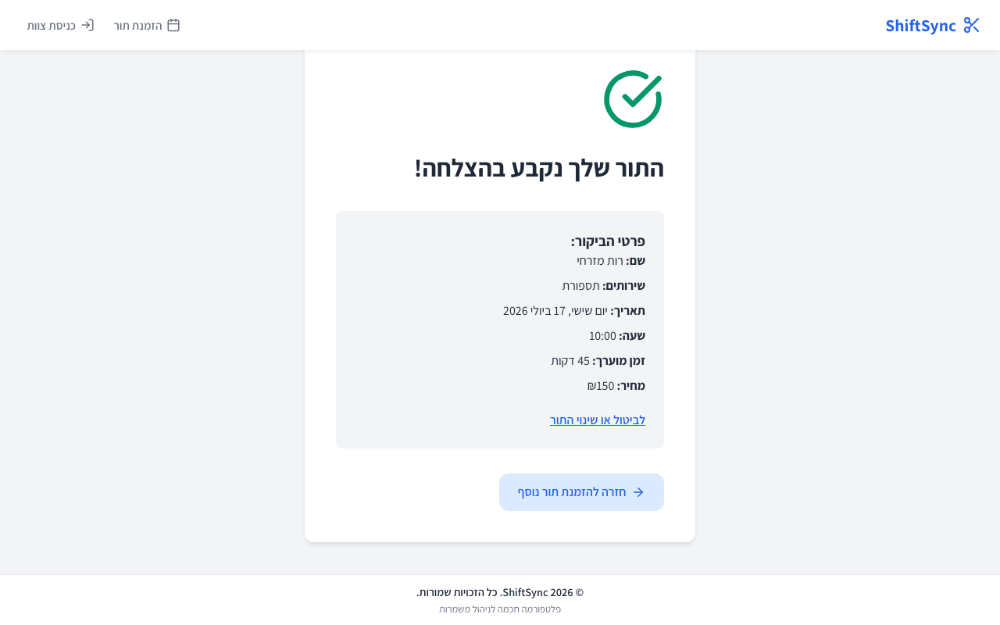
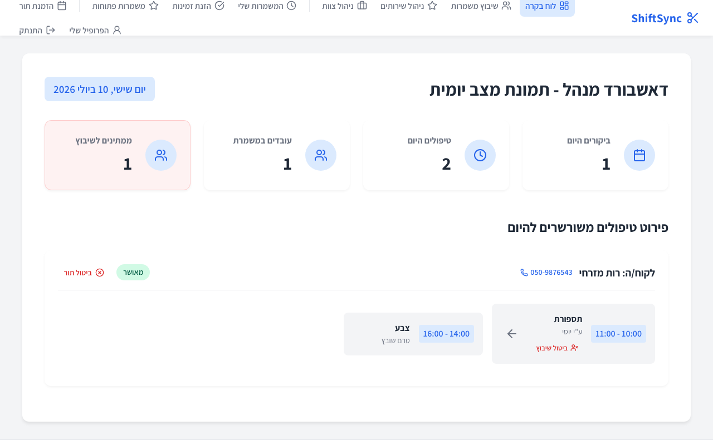
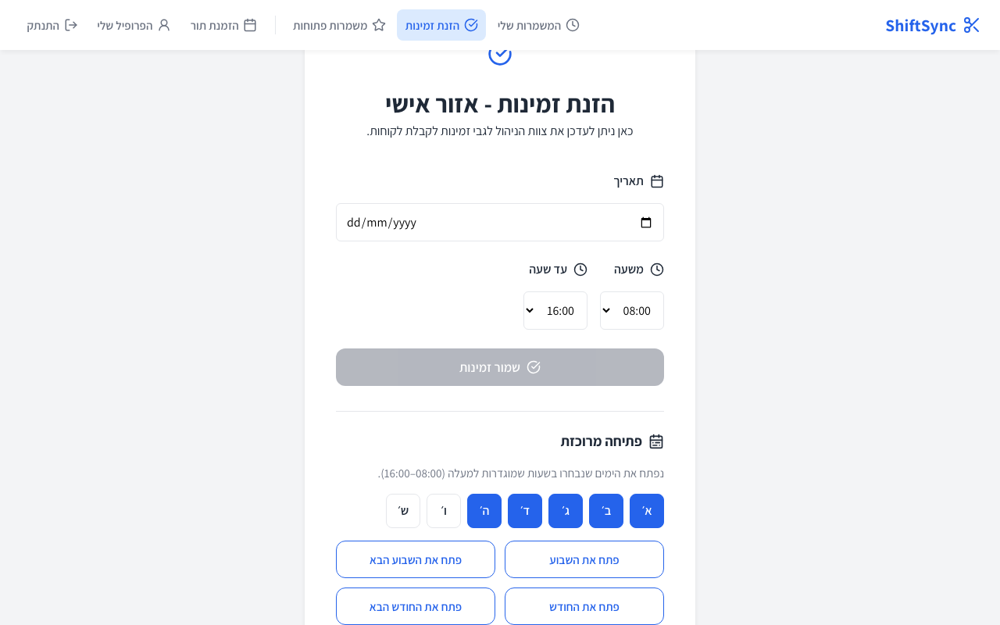

# ShiftSync (FP Shifter)

**Live app:** [https://fp-shifter.vercel.app](https://fp-shifter.vercel.app)  
**Repository:** [https://github.com/avitaltch/fp-shifter](https://github.com/avitaltch/fp-shifter)

ShiftSync is an online booking and shift-management system for service businesses (demo: a beauty salon). Customers book only when a qualified employee is free; managers run the day; employees publish availability and claim open work.

Built with **React 19 + Vite** (Hebrew, RTL) and **Supabase** (Postgres, Auth, RLS, Edge Functions).

---

## The problem

Small salons and clinics still run bookings and shifts on WhatsApp, paper diaries, or a shared Excel sheet. That creates double-bookings, no-shows that nobody can cancel online, and managers who spend evenings matching “who is free” with “who can do the service.” Staff cannot see their own schedule in one place, and customers have no self-service way to manage a booking after they leave the site.

## Target audience

| Role | When they use it |
| --- | --- |
| **Customers** | Book a visit online, then view/cancel via confirmation number + phone |
| **Employees** | Publish availability (including bulk week/month), see assigned shifts, claim open shifts, edit profile |
| **Managers (Admin)** | Services, team (invite / deactivate / skills), dashboard, assign/unassign shifts |

Primary buyer: owner/manager of a single-location service business (salon, clinic, studio) that already has a small staff and wants one Hebrew RTL tool instead of chat + spreadsheet.

## Competitors and differentiation

| Alternative | What it does | Where ShiftSync differs |
| --- | --- | --- |
| WhatsApp / phone | Manual booking | Self-service booking + manage page; no chat backlog |
| Excel / Google Sheets | Shared calendar | Real-time conflict prevention in the database; role-based access |
| Generic calendar tools | Free/busy only | Skills + availability drive which slots appear; auto-assign least-loaded qualified staff |
| Heavy salon SaaS (e.g. Treatwell-style) | Full marketplace | Single-business, invite-only staff, Hebrew RTL, no marketplace fees |

**Core differentiation:** customers never see a slot unless a qualified, available employee can take it — enforced in Postgres RPCs and an exclusion constraint, not only in the UI.

---

## Try the live product

**Customer booking needs no account** — open the live app and book immediately.

| Flow | How |
| --- | --- |
| **Customer booking (no login)** | Open [/book](https://fp-shifter.vercel.app/book) → pick services → date/time → details → confirmation |
| **Manage / cancel a booking** | [/book/manage](https://fp-shifter.vercel.app/book/manage) with confirmation number + phone from the success page |
| **Staff login** | [/login](https://fp-shifter.vercel.app/login) — invite-only (no public sign-up) |

> **Demo staff credentials** (admin / employee email + password) are in the submission document [`SUBMISSION.md`](SUBMISSION.md) — fill them in before handing in to Classroom.
>
> **Local demo database (fast path):** run [`supabase/install_all.sql`](supabase/install_all.sql) in the Supabase SQL editor, invite staff, then run [`supabase/seed.sql`](supabase/seed.sql) for services, ~90 days of availability, demo customers, and sample appointments (dashboard / assign / open shifts).

---

## External services and integrations

| Service | Type | Role in the product |
| --- | --- | --- |
| **Supabase Auth** | Authentication | Invite-only staff accounts; password set/recovery; JWT for protected routes and Edge Functions |
| **Supabase Postgres** | Database | All business data; RLS; exclusion constraints against double-booking |
| **Supabase RPC (security definer)** | Server logic | `get_available_slots`, `book_appointment`, `claim_shift`, `cancel_appointment`, customer manage RPCs, admin assign/unassign/deactivate |
| **Supabase Edge Function (`invite-user`)** | Server logic | Admin invites staff with the **service-role** key (never shipped to the browser) |
| **Supabase Auth email** | Email | Invite and password-reset links back to `/login` |
| **Vercel** | Hosting | Production SPA deploy + SPA rewrites for React Router |

No Google OAuth and no third-party AI API in the product runtime — AI was used in the *build process* (Cursor agents), not as a live product dependency.

---

## Database ERD (Supabase)

```mermaid
erDiagram
  auth_users ||--|| users : "id"
  customers ||--o{ appointments : "customer_id"
  appointments ||--|{ appointment_items : "appointment_id"
  service_types ||--o{ appointment_items : "service_type_id"
  users ||--o{ appointment_items : "user_id (nullable)"
  users ||--o{ employee_skills : "user_id"
  service_types ||--o{ employee_skills : "service_type_id"
  users ||--o{ availabilities : "user_id"

  customers {
    uuid id PK
    text first_name
    text last_name
    text email
    text phone UK
    text address
    text notes
    timestamptz deleted_at
  }

  users {
    uuid id PK_FK
    text first_name
    text last_name
    text role
    text phone
    date hire_date
    timestamptz deleted_at
  }

  service_types {
    uuid id PK
    text name UK
    text description
    numeric base_price
    int default_duration
    timestamptz deleted_at
  }

  employee_skills {
    uuid id PK
    uuid user_id FK
    uuid service_type_id FK
  }

  appointments {
    uuid id PK
    uuid customer_id FK
    date visit_date
    numeric total_price
    text status
    timestamptz deleted_at
  }

  appointment_items {
    uuid id PK
    uuid appointment_id FK
    uuid service_type_id FK
    uuid user_id FK
    date work_date
    time start_time
    time end_time
    text status
    timestamptz deleted_at
  }

  availabilities {
    uuid id PK
    uuid user_id FK
    date available_date
    time start_time
    time end_time
  }
```

**Design notes**

- `users` extends `auth.users` (1:1); role is `Admin` | `Employee` and is RLS-protected.
- Booking creates `appointments` + `appointment_items`; items may be unassigned (`user_id` null) for the open-shift pool.
- Overlapping assignments for the same employee are blocked by a GiST **exclusion constraint**.
- Soft deletes (`deleted_at`) keep history while hiding inactive rows from day-to-day lists.

Source of truth: [`supabase/schema.sql`](supabase/schema.sql). You can also open **Supabase → Database → Schema Visualizer** for a live screenshot.

---

## Main product flows

1. **Customer books** → `get_available_slots` → `book_appointment` (server pricing, skills, conflicts) → success page with confirmation number → optional `/book/manage`.
2. **Employee opens availability** → single day or bulk week/month with workday toggles → appears in slot generation.
3. **Manager runs the day** → dashboard (cancel / unassign / call customer) → assign open items (server-checked) → team invite / skills / deactivate.

---

## Screenshots

Captured from the real React app (Hebrew RTL) against the network-stubbed Playwright setup (`node scripts/screenshots.mjs`).

| | |
| --- | --- |
| **Customer booking** — services, date, and available slots | **Booking success** — confirmation summary + manage link |
|  |  |
| **Admin dashboard** — today’s visits, treatments, open items | **Employee availability** — bulk open week/month + workday toggles |
|  |  |

---

## AI-assisted development (Vibe Coding)

This project was built in **Cursor** with AI agents as the primary coding workflow (not as a runtime product dependency).

1. **Parallel audits** — explore subagents reviewed auth/user lifecycle, customer booking, and admin/employee flows concurrently, then findings were prioritized (high → medium).
2. **Scoped fixers** — fixer subagents implemented confirmed gaps with strict file scopes so disjoint work (e.g. auth vs booking) could run in parallel without colliding.
3. **Reviewer → builder loop** — a **GLM** reviewer agent inspected feature commits; its findings were fed back to a **Grok** builder agent for fixes (example: bulk availability week/month + workday toggles).
4. **Model mix** — different models per task (explore/audit, implement, review) rather than one model for everything.
5. **TDD / CI guardrails** — features land with Vitest coverage (**334** unit tests), network-stubbed Playwright e2e (`npm run e2e`), and CI (lint + unit + build + e2e) on every push/PR.

---

## Architecture (for developers)

```
src/
  lib/api/          Domain API (booking, availability, shifts, team, …)
  hooks/            useAsyncData, useAction
  context/          AuthContext (role from public.users)
  pages/            One page per route
supabase/
  schema.sql / rls.sql / functions.sql
  edge-functions/invite-user/
```

### Security model (short)

- Roles in `public.users`, not `user_metadata`.
- Public sign-up disabled; staff invited via Edge Function.
- Anon can only call booking/manage RPCs + read active services.
- Client `ProtectedRoute` is UX; enforcement is RLS + security-definer RPCs.

---

## Setup (local)

1. Create a Supabase project.
2. SQL editor: run [`supabase/install_all.sql`](supabase/install_all.sql) (or, in order: `schema.sql` → `rls.sql` → `functions.sql`).
3. Auth → Email: disable “Allow new users to sign up”.
4. Bootstrap first Admin after invite:
   ```sql
   update public.users set role = 'Admin'
   where id = (select id from auth.users where email = 'you@example.com');
   ```
5. Optional demo data: [`supabase/seed.sql`](supabase/seed.sql).
6. `cp .env.example .env` → set `VITE_SUPABASE_URL` and `VITE_SUPABASE_ANON_KEY`.
7. `npm install && npm run dev`

## Deploy (Vercel)

1. Import the repo; Vite preset (`npm run build` → `dist/`).
2. Env: `VITE_SUPABASE_URL`, `VITE_SUPABASE_ANON_KEY`.
3. Supabase Auth → Site URL / Redirect URLs = production URL.
4. Edge Function:
   ```bash
   supabase functions deploy invite-user --project-ref <ref>
   supabase secrets set SITE_URL=https://fp-shifter.vercel.app
   ```
   (If the CLI expects `supabase/functions/`, symlink from `supabase/edge-functions/invite-user`.)

## Scripts

| Command | What it does |
| --- | --- |
| `npm run dev` | Vite dev server |
| `npm test` | Vitest unit tests |
| `npm run e2e` | Playwright E2E (stubbed) |
| `npm run screenshots` | Capture README PNGs into `docs/screenshots/` (stubbed) |
| `npm run build` | Production build |

CI runs lint, unit tests, build, and e2e on every push/PR.
