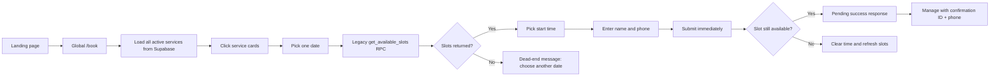
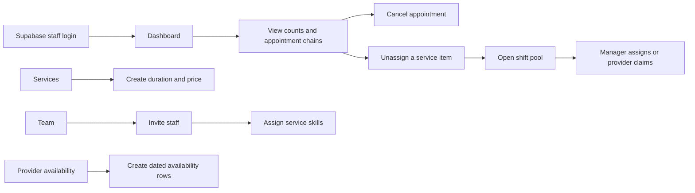
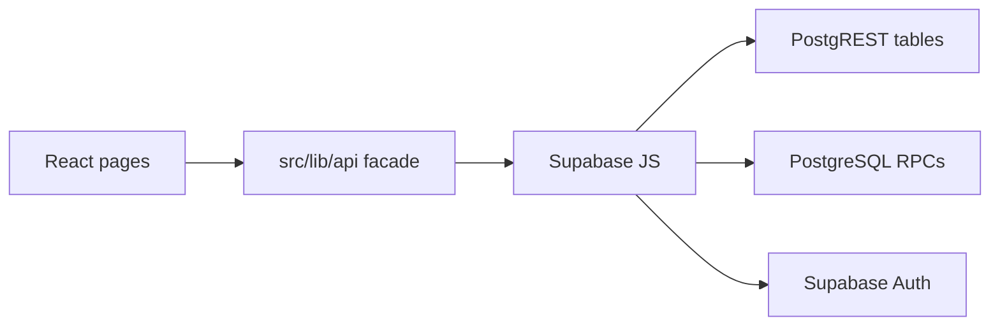
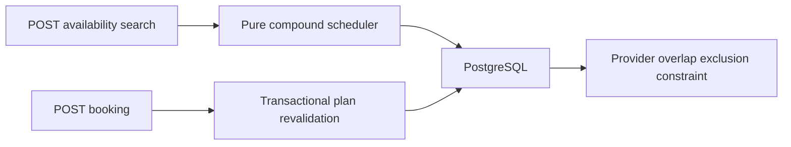

# ShiftSync product flow audit

**Status:** Proposed product and architecture direction

**Date:** 2026-08-17

**Scope:** Current React/Supabase demo, implemented NestJS/PostgreSQL scheduling slice, PRD alignment, and external booking-flow patterns

## Executive conclusion

ShiftSync has a credible scheduling engine but does not yet have a product flow that proves its value.

The current browser experience is still a single-business, Supabase-shaped appointment form. It allows several services to be clicked in sequence, but it does not let a customer deliberately build, reorder, review, or recover a compound visit. The manager and provider areas are still organized around “open shifts” and manual assignment even though the target product promises that a confirmed public booking is already fully assigned.

The next milestone should therefore be a real customer-facing vertical slice, not another broad visual pass or more staff screens:

1. Open a business-specific booking link.
2. Build an explicit ordered visit.
3. See only complete, feasible appointment plans from NestJS.
4. Review the whole visit before committing.
5. Confirm every step atomically in PostgreSQL.
6. Recover gracefully from no availability or a booking race.

The product should call this object a **visit** in the UI. Internally it remains an `appointment` containing ordered `appointment_steps`.

## Research method

This audit is based on:

- every React route and primary navigation entry;
- customer, manager, provider, authentication, and configuration pages;
- the frontend API facade and direct Supabase dependencies;
- all Playwright journeys and their mocked network contracts;
- the NestJS public availability and booking APIs;
- the PostgreSQL appointment/step model and scheduler contract;
- `PRD_MVP.md`, `DEVELOPMENT_PLAN_V2.md`, and the accepted architecture decisions;
- current captured desktop screens;
- official Fresha, Square, and GOV.UK flow guidance listed under “External pattern research”.

This is a code-informed expert review. It is not a substitute for observing real owners, staff, or customers; the final section defines the minimum user research needed before a pilot.

## Current information architecture

### Public

- `/` — product landing page
- `/about` — legacy company/product description
- `/book` — global booking form
- `/book/success` — booking confirmation
- `/book/manage` — appointment lookup and cancellation
- `/book/:businessId` — redirects back to the global booking form
- `/login` — staff login, invite completion, and password recovery

### Manager

- `/admin/dashboard` — today plus the coming week, cancellation, unassignment
- `/admin/assign` — manually assign open appointment items
- `/admin/services` — service CRUD
- `/admin/team` — invitations, roles, profile details, skills, deactivation

### Provider

- `/employee/shifts` — assigned service items and status progression
- `/employee/availability` — single-date or bulk availability creation
- `/employee/recommendations` — claim open service items
- `/employee/profile` — profile and password

### Navigation problem

One global navigation serves anonymous customers, managers, and providers. Staff see a long mixture of management, work, public booking, profile, and authentication actions. The public booking journey also inherits staff-oriented chrome.

Target information architecture should use two shells:

- **Public booking shell:** business identity, location/contact details, “manage booking”, and a compact booking progress indicator.
- **Staff operations shell:** Calendar, Attention, Team, Services, Availability, Notifications, and Settings, filtered by role.

## Current customer journey



### What works

- Booking is account-free and mobile responsive.
- Services, prices, durations, time slots, and contact fields have clear labels.
- Selected services receive visible order badges.
- Total duration and price update as services are selected.
- A stale slot refreshes without discarding the customer’s contact information.
- Empty, network-error, validation, and booking-race states are tested.
- The success page persists a local confirmation snapshot across refresh.

### Where the journey breaks down

| Finding | Severity | Evidence | Product impact |
|---|---|---|---|
| Booking is not business-specific | Critical | `/book/:businessId` redirects to `/book`; `listServices()` has no tenant or slug | The system cannot safely represent 100 businesses or show business identity, policies, timezone, or contact details. |
| The React flow does not call NestJS | Critical | Every frontend API module still imports `supabase`; no API base URL or REST adapter exists | The differentiating scheduler and atomic booking command cannot be experienced in the product. |
| Service order is implicit click order | High | A selected ID is appended to an array; cards only toggle inclusion | Customers cannot drag, move, or remove from an itinerary; duplicate service steps are impossible. This misses P0-04. |
| The form exposes all stages on one long page | High | Service, date/time, personal details, and submit share one form | On mobile, users must understand several decisions at once and can submit without a deliberate review moment. |
| There is no review-before-confirmation step | High | Choosing a slot and filling contact data enables “Confirm booking” directly | The most important product artifact—the complete visit and handoffs—is never presented as a coherent commitment. |
| No availability is a dead end | High | The only action is “choose another date” | There is no next available date, nearby alternative, broader search, or waitlist entry. This discards high-intent demand. |
| Success semantics disagree with the target product | High | The legacy E2E fixture returns `Pending`; target NestJS returns `Confirmed` with complete steps | The UI still normalizes manual repair as part of successful booking, contradicting “no complete plan, no confirmed booking.” |
| Customer management uses weak knowledge factors | High | Appointment ID plus phone number is the access credential | It does not meet the PRD requirement for an unguessable, expiring, revocable management credential. |
| The compound plan is not visible | High | Slot chips show a start time only; the success view lists service names as a comma-separated string | Customers cannot verify the ordered service timeline, expected handoffs, or exact visit end time before booking. |
| Contact policy is underspecified | Moderate | UI asks only for phone; NestJS accepts E.164 phone and optional email | The flow does not explain which channel receives confirmation or conditionally require the information needed by business policy. |
| No product events are emitted | Moderate | Required PRD events have no frontend or first-party event implementation | There is no evidence about abandonment, no-slot demand, ordering behavior, or booking conversion. |

## Current manager journey



### What works

- The dashboard already groups service items under a customer visit.
- Ordered times and assigned providers are visible.
- Cancellation and unassignment use guarded server operations in the legacy backend.
- Team skills, staff lifecycle, services, and availability exist as reusable concepts.
- The database and target scheduler already treat provider conflicts as authoritative server concerns.

### Where the journey breaks down

| Finding | Severity | Product impact |
|---|---|---|
| The primary mental model is “shift management” | Critical | `Assign shifts` and `Open shifts` are top-level destinations, even though a valid public booking should never create unassigned steps. The UI teaches the opposite of the product promise. |
| There is no manager-created booking flow | High | Phone, walk-in, and reception bookings cannot enter the same authoritative calendar through the target scheduling rules. |
| Configuration has no guided dependency order | High | A manager can create services, invite providers, map skills, and add availability, but there is no checklist or readiness test explaining what remains before booking can be published. |
| Business hours are missing from the UI | High | NestJS needs business hours to produce plans, but the manager cannot configure them in the current product. |
| No operational calendar | High | A list for today and upcoming visits is useful for a demo but insufficient for scanning day/week capacity, provider lanes, gaps, and handoffs. |
| Exceptions are spread across pages | High | Unassigned work, cancellation, staff availability changes, and provider deactivation do not converge into one “needs attention” queue. |
| Staff changes do not preview visit impact | High | The PRD requires a reassignment or action path before a confirmed appointment becomes invalid. The current legacy flow simply returns assignments to an open pool. |
| The manager does not see scheduling explanations | Moderate | Scheduler diagnostics exist, but there is no internal view explaining missing skills, unavailable providers, or affected steps. |
| Product copy is inconsistent | Moderate | The landing page describes compound visits, while About and several staff pages still describe a generic shift-management product. |

## Current provider journey

### What works

- Providers see only assigned service items and can progress `Scheduled → In progress → Done`.
- Availability supports a single date and bulk opening by selected weekdays.
- Open-work eligibility explains missing skill, missing availability, or time conflict.
- Role-protected mobile flows and race conditions have browser coverage.

### Where the journey breaks down

| Finding | Severity | Product impact |
|---|---|---|
| A provider sees an isolated task, not their part of a visit | High | There is no “step 2 of 3”, previous/next service, handoff partner, or whole-visit timing. Providers cannot prepare a smooth customer handoff. |
| Availability is generated as many dated rows | Moderate | “Open this month” is helpful for a prototype but creates repetitive data and weak editing semantics. A recurring weekly schedule plus date exceptions better matches operations. |
| Claiming open shifts is over-promoted | Moderate | It should be an exception/recovery tool after a disruption, not a primary navigation concept for normal confirmed bookings. |
| Status progression lacks operational safeguards | Moderate | There is no late-start, blocked, no-show, or manager-attention path; the only available action is advance status. |

## Architecture reality

### Current production-shaped path



### Implemented but disconnected target slice



The target backend is materially farther along than older planning text suggests:

- business-slug tenant resolution exists;
- tenant-safe scheduling tables and repositories exist;
- ordered multi-provider availability exists;
- atomic booking and real concurrency protection exist.

The vertical slice is still incomplete because it lacks:

- a public business/catalog read endpoint;
- a frontend NestJS transport adapter;
- idempotency for duplicate booking submissions;
- customer-management tokens and cancellation endpoints;
- authenticated manager/provider APIs;
- notifications, waitlist, and analytics events.

### Contract mismatch

The availability response currently returns only start/end slots and discards the scheduler’s step plan and `handoffCount`. The booking response returns step service IDs and times but not the service snapshots needed for a useful confirmation. The frontend’s legacy types use local dates/times and shekel amounts, while NestJS uses ISO instants, E.164 phone numbers, minor currency units, and camelCase fields.

This is the migration seam to stabilize before redesigning more pages.

## External pattern research

### What established products teach us

1. [Fresha’s documented customer journey](https://www.fresha.com/help-center/knowledge-base/online-profile/102078-learn-how-clients-book-appointments-online) supports multiple services, optional professional selection for each service, real-time availability, and a final review of services, time, staff, price, business information, and notes.
2. [Fresha service sequencing](https://www.fresha.com/help-center/knowledge-base/catalog/74-set-up-and-manage-service-booking-sequencing) lets businesses define required service order and lets staff rearrange sequences.
3. [Square’s multi-staff appointment model](https://squareup.com/help/us/en/article/7238-multi-staff-appointment-staff-scheduling) treats one appointment as several services that can belong to different staff calendars.
4. [Square’s waitlist](https://squareup.com/help/us/en/article/7923-waitlist-with-square-appointments) places “Join waitlist” directly in the no-preferred-time state and retains service plus availability preferences.
5. [Fresha’s waitlist lifecycle](https://www.fresha.com/help-center/knowledge-base/calendar/102080-manage-waitlist-entries-1) automatically advances to the next customer when the first notified customer does not book in time.
6. [GOV.UK form-structure guidance](https://www.gov.uk/service-manual/design/form-structure) recommends starting with one decision per page for comprehension, mobile use, error recovery, and measurable funnels.
7. [GOV.UK’s check-answers pattern](https://design-system.service.gov.uk/patterns/check-answers/) recommends a review step immediately before submission, with direct ways to change each section without losing earlier answers.

### Competitive implication

“One appointment with several services and staff” is not unique by itself. ShiftSync should differentiate on the outcome and workflow:

- the customer chooses the visit, not the staffing puzzle;
- every displayed time already supports the complete ordered visit;
- the system minimizes and clearly communicates handoffs;
- managers see exceptions and recovered capacity rather than repairing ordinary bookings;
- Hebrew-first, low-cost operation remains a market and deployment advantage.

This should become the core message: **Choose everything you need. ShiftSync finds one complete visit that works.**

## Proposed customer journey

```mermaid
stateDiagram-v2
  [*] --> BusinessContext
  BusinessContext --> BuildVisit
  BuildVisit --> ChoosePlan: at least one ordered service
  ChoosePlan --> NoAvailability: no complete plan
  NoAvailability --> ChoosePlan: broaden date or time
  NoAvailability --> Waitlist: save preferences
  ChoosePlan --> ContactDetails: plan selected
  ContactDetails --> Review
  Review --> BuildVisit: change services
  Review --> ChoosePlan: change time
  Review --> ContactDetails: change contact
  Review --> Submitting: confirm
  Submitting --> Confirmed: transaction committed
  Submitting --> ChoosePlan: plan conflict; preserve draft
  Confirmed --> ManageVisit: secure action link
  Waitlist --> [*]
  ManageVisit --> Cancelled: cancel complete visit
```



### Step 0 — Business context

Show business name, logo/initial, address, timezone-aware hours, contact, cancellation policy, and trust cues. The route is `/book/:businessSlug`; unknown or unpublished businesses receive a branded unavailable page.

### Step 1 — Build your visit

- Browse categorized services with price, duration, and short description.
- Add a service to an explicit itinerary instead of toggling a card.
- Show sequence number, remove, move earlier/later, and add again.
- Offer common prebuilt combinations as shortcuts, not separate scheduler rules.
- Keep a persistent summary with total price and duration.
- Explain that ShiftSync will choose qualified available staff unless the business enables customer preference.

### Step 2 — Choose a complete plan

- Search several nearby dates, not one date at a time.
- Present a horizontal date strip with availability counts and morning/afternoon grouping.
- Each option shows visit start/end and total duration.
- On selection, show a compact timeline of service steps and handoff count.
- Provider names remain hidden unless business policy explicitly exposes them.
- If nothing is available, show: next available dates, adjust services, broaden time preference, and join waitlist.

### Step 3 — Contact details

- Ask only for information required to deliver and manage the booking.
- Use one full-name field unless the business has a real need for separate names.
- Normalize Israeli phone input to E.164 behind the form.
- Ask for email only when required by notification policy or when the customer chooses email.
- Separate transactional contact permission from future marketing consent.
- Allow an optional note for the business.

### Step 4 — Review and confirm

Show a single coherent visit summary:

- business and location;
- ordered service timeline;
- date, start, end, and duration;
- provider/handoff visibility according to policy;
- price and currency;
- contact destination and expected notification channel;
- cancellation terms;
- “Change” action for services, plan, and contact details.

The CTA should be explicit: “Confirm visit — ₪350”, not a generic “Continue”.

### Step 5 — Confirmation

- Confirm that the complete visit is booked, not merely received.
- Show the ordered timeline and all totals from the server-owned booking snapshot.
- Explain where confirmation/reminders will arrive.
- Provide “Add to calendar”, “Manage or cancel”, and “Book another visit”.
- Store no management secret in logs or analytics; deliver the secure management URL in the response and notification.

### Race recovery

When PostgreSQL returns `PLAN_NO_LONGER_AVAILABLE`:

- retain services and contact details;
- return to plan selection;
- announce that the selected option was taken;
- show refreshed closest alternatives;
- focus the message and plan list for keyboard/screen-reader users.

## Proposed manager journey

### Guided activation

Replace disconnected configuration pages with a readiness checklist:

1. Business and location details.
2. Business hours and booking policy.
3. At least one active service.
4. Providers invited or created.
5. Skills mapped for every active service.
6. Recurring availability and exceptions configured.
7. Feasibility test finds at least one future plan.
8. Publish the booking link.

Every blocked step should say why and deep-link to the relevant control.

### Daily operations

The default manager screen should be a day/week calendar plus an attention queue, not stat cards plus a manual assignment funnel.

- Treat each customer visit as one visual container.
- Render nested service steps across provider lanes.
- Mark handoffs and tight transitions clearly.
- Put cancellations, provider changes, late steps, notification failures, and no-solution reassignments in “Needs attention”.
- Keep ordinary fully assigned bookings out of the exception queue.
- Add “Create visit” using the same Visit Builder and availability contract as the public flow, with optional provider preference.

### Configuration model

- **Services:** duration, price, active status, description; later buffers and variants.
- **Team:** membership, role, skills, visibility, active status.
- **Schedule:** recurring weekly availability plus date-specific exceptions/time off.
- **Booking settings:** interval, advance window, cancellation policy, staff visibility, customer notification channel, waitlist behavior.
- **Publish:** booking link, readiness status, and preview.

## Proposed provider journey

- Default to “My day”, grouped by complete visits.
- For each assigned step show “step 2 of 3”, prior/next service, handoff time, and relevant provider display name.
- Keep start/complete as the only normal mutation.
- Add “Cannot start / needs help” to create a manager exception without editing scheduling data.
- Model normal availability as a recurring weekly schedule with date exceptions.
- Move claimable work under an exception or opportunities area; do not present it as the normal state of confirmed public bookings.

## Target frontend architecture

### Separate shells, shared domain UI

```text
src/
  app/
    public-booking/       Business-specific customer shell
    staff-operations/     Authenticated manager/provider shell
  features/
    visit-builder/        Ordered service draft and summary
    plan-picker/          Availability search and plan selection
    booking-review/       Review and confirmation
    operations-calendar/ Visit/step calendar and attention states
  lib/
    api/
      contract/           Stable frontend domain types
      nest/               REST implementation
      supabase/           Temporary legacy implementation
```

Use one `VisitDraft` reducer/state machine for customer and manager creation. Changing services must invalidate the selected plan; changing contact details must not. The URL or session draft may preserve non-sensitive progress, but contact details should not be placed in query parameters.

### Frontend domain contract

The UI should consume normalized domain objects rather than Supabase rows:

```ts
type VisitDraft = {
  businessSlug: string;
  steps: Array<{ draftId: string; serviceId: string }>;
  selectedPlanKey?: string;
  customer?: CustomerDraft;
};

type PublicPlan = {
  planKey: string;
  startsAt: string;
  endsAt: string;
  handoffCount: number;
  steps: Array<{
    sequenceNumber: number;
    serviceId: string;
    startsAt: string;
    endsAt: string;
  }>;
};
```

`draftId` is required because the same service may appear more than once.

## Target API boundary

### Public catalog

- `GET /api/v1/public/businesses/:businessSlug`
  - business display name, location, timezone, booking window, cancellation summary, staff-visibility policy, supported contact channel;
- `GET /api/v1/public/businesses/:businessSlug/services`
  - active service snapshots grouped for display.

### Availability

- Keep `POST /availability/search`.
- Return a presentation-safe plan per slot, including step times and handoff count.
- Do not expose provider IDs publicly.
- Add closest alternative dates or a cheap availability-calendar summary so the frontend does not probe 60 dates serially.
- Keep results advisory; no hidden hold is implied.

### Booking

- Keep atomic `POST /bookings`.
- Require an `Idempotency-Key` for safe retries/double taps.
- Submit `serviceIds`, selected start, local date, contact data, and optional note.
- Return a complete immutable confirmation snapshot: business, location, service names, step times, total, notification expectation, and a one-time management URL/token delivery result.
- On conflict, return stable code `PLAN_NO_LONGER_AVAILABLE` and optionally refreshed alternatives.

### Management

- `GET /api/v1/public/appointments/manage/:token`
- `POST /api/v1/public/appointments/manage/:token/cancel`
- Token is unguessable, revocable, time-limited as policy requires, and stored hashed.

### Staff operations

Keep a modular monolith. Add authenticated modules around existing domain boundaries rather than separate services:

- `Auth/Tenancy`
- `Catalog/Workforce`
- `Scheduling`
- `Appointments/Operations`
- `Notifications`
- `Waitlist`
- `Audit/ProductEvents`

No Redis, message broker, microservice split, or client-side scheduling logic is justified for this MVP.

## Priority decisions

### P0 — prove the value proposition

1. Add public business and service catalog endpoints.
2. Add a NestJS REST implementation behind `src/lib/api`.
3. Restore `/book/:businessSlug` as the canonical route.
4. Build the ordered Visit Builder with remove, reorder, and duplicate support.
5. Expand the availability response into safe plan summaries.
6. Split booking into Build visit → Choose plan → Details → Review → Confirmation.
7. Add booking idempotency and secure management tokens.
8. Add one real React → NestJS → PostgreSQL browser journey.

### P0 — align staff operations

1. Reframe appointment items as visit steps, not shifts.
2. Move manual assignment/open work into an attention/recovery flow.
3. Build manager-created visits with the shared Visit Builder.
4. Add business hours and recurring schedule configuration.
5. Give providers compound-visit context.

### P1 — capture lost demand and validate economics

1. Add the contextual no-slot waitlist flow.
2. Add fake/local notification adapters and reminder events.
3. Implement the sequential backfill offer lifecycle.
4. Record booking and scheduling product events in PostgreSQL.
5. Surface recovered revenue and coordination exceptions to managers.

## Recommended implementation sequence

| Slice | Outcome | Dependencies |
|---|---|---|
| 1. Contract bridge | Business catalog endpoints, normalized frontend types, NestJS API client | Existing scheduler schema |
| 2. Visit Builder | Explicit ordered services with duplicate/remove/reorder behavior | Public catalog |
| 3. Plan Picker | Multi-date complete-plan selection and no-result alternatives | Availability contract |
| 4. Review and commit | Review screen, idempotent atomic booking, conflict recovery | Booking command |
| 5. Secure lifecycle | Confirmation snapshot, management token, cancellation | Token and cancellation backend |
| 6. Operations alignment | Manager calendar/attention queue and provider handoff context | Authenticated tenant APIs |
| 7. Demand recovery | Waitlist, fake notifications, backfill | Outbox worker |

Do not redesign every existing staff page before Slice 4. The customer vertical slice is the earliest commercially meaningful proof and will stabilize the domain language used everywhere else.

## Measurement plan

Implement first-party product events before a pilot:

- booking page opened;
- service added, removed, duplicated, and reordered;
- availability requested and result count;
- no-plan reason category;
- plan selected;
- review opened and section changed;
- booking submitted, succeeded, or failed by stable reason;
- compound visit confirmed;
- waitlist joined;
- management link opened;
- appointment cancelled.

Core funnel:

```text
business page → first service → complete service sequence → plan selected
→ review opened → booking confirmed
```

Segment by business, device class, service count, handoff count, and no-availability state. Do not place names, phone numbers, email addresses, or management tokens in events.

## Minimum user research before pilot

### Manager discovery: five businesses

Observe, do not only interview:

1. Ask each manager to schedule a simple booking.
2. Ask them to schedule trim → vaccine with two providers.
3. Remove a provider after the booking and ask what they expect to happen.
4. Cancel a booking and ask how they choose whom to contact for backfill.
5. Record current coordination time, tools, messages, and failure points.

Success signal: at least four of five immediately understand the visit/step model and say the automatic plan removes a task they currently perform manually.

### Customer usability: five mobile-first participants

Test a clickable or seeded implementation with:

1. one service;
2. three ordered services with one handoff;
3. no availability followed by waitlist entry;
4. a slot-race recovery;
5. management-link cancellation.

Measure completion, time, backtracks, incorrect assumptions about staff assignment, and confidence before confirmation. Target 4/5 unassisted completion for the compound journey before visual polish is treated as done.

### Provider comprehension: three providers

Ask each provider to explain:

- what service they perform;
- when the customer arrives to them;
- what happens immediately before and after;
- what they do when they cannot start.

If the provider cannot answer from one card, the operational design is incomplete.

## Final recommendation

Pause expansion of the legacy shift-management experience. Build the business-specific NestJS customer vertical slice and use it to establish the product’s durable concepts: **business, visit, ordered step, complete plan, handoff, attention state, and recovered opening**.

That slice is both the shortest route to a convincing demo and the architecture seam that allows Supabase to be removed without rewriting the UI twice.
